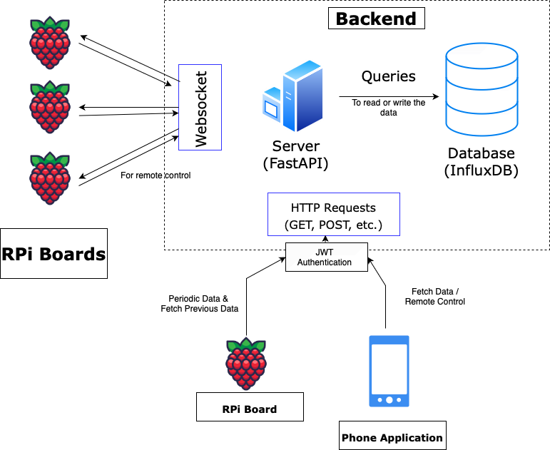

# Server Architecture Overview

This document describes the overall architecture of our server application, the reasons behind our technology choices, and how our approach has evolved over time. Below is a diagram illustrating the current system setup:

## Technology Choices

### 1. FastAPI for the Backend

- **Reasoning**:
  - **Django** was deemed too heavy for our needs, especially since we wanted something lightweight for both HTTP and WebSocket handling.
  - **Flask** is too minimal for our product, and it doesn’t natively handle WebSockets as elegantly.
  - **FastAPI** strikes a balance: it’s performant, easy to integrate with WebSockets, and works well with various databases (including InfluxDB).

### 2. InfluxDB for Time-Series Data

- **Reasoning**:
  - We deal with time-indexed data (power metrics like voltage, current, power factor, THD, etc.).
  - **InfluxDB** is optimized for time-series storage and querying, which fits our use case better than a general NoSQL database like MongoDB.
  - It provides powerful querying, retention policies, and downsampling capabilities out of the box.

### 3. Flutter for the Frontend

- **Reasoning**:
  - We needed a cross-platform solution for mobile and possibly desktop/web in the future.
  - The team was already familiar with **Flutter**, which sped up development.

### 4. SQLite for Local Caching on the RPi

- **Reasoning**:
  - In scenarios where the RPi cannot send data to the server (e.g., network downtime), we locally store the data in **SQLite**.
  - SQLite is file-based, lightweight, and well-suited for embedded environments.
  - Once the connection is restored, the RPi pushes any cached data to the server, and older entries are cleaned up if they’re beyond 3 days.

## System Evolution

1. **Initial Plan (Waveform Storage)**

   - We initially considered storing raw waveforms from the ADE9000 to analyze full harmonic spectra.
   - This proved too large and less necessary for our immediate goals.

2. **Current Data Collection (RMS & Power Metrics)**

   - We now store the following RMS and power-related fields each second, for each phase:
     - `power_watt`
     - `power_var`
     - `power_va`
     - `voltage_rms`
     - `current_rms`
     - `power_factor`
     - `voltage_thd`
     - `current_thd`
     - `energy_kwh`
   - These values provide enough insight for real-time monitoring and analytics without the overhead of storing raw waveforms.

3. **Local Data Storage on RPi**
   - In case of network issues, the RPi caches data in SQLite.
   - **Approximate Storage Calculation**:
     - Sampling every second for 6 hours = `60 sec * 60 min * 6 hr = 21,600` samples.
     - For 3 phases, that’s `21,600 * 3 = 64,800` phase-specific samples.
     - With 9 fields, total data points = `64,800 * 9 ≈ 583,200`.
     - Assuming 8 bytes per float, that’s roughly `4.66 MB` over 6 hours (plus some overhead for SQLite).
   - After the RPi successfully sends cached data to the server (and if it’s older than 3 days), it is deleted to free space.

## Server Setup Details

1. **Authentication**

   - We use a token-based approach (e.g., JWT or similar).
   - Incoming requests (e.g., from the Flutter app) must include a valid token, which the server verifies (`verify_token`) before granting access to protected endpoints.

2. **REST Endpoints**

   - **Data Ingestion** (`/write-data`): The RPi sends sensor data here.
   - **Data Queries** (`/query-data`, `/latest-values`, `/thd-values`, etc.): The Flutter app (or any other client) requests historical or real-time metrics.
   - **Analytics** (`/fetch-analytics`): Returns computed insights from InfluxDB.

3. **WebSockets**

   - **Endpoint** (`/ws`): The RPi establishes a persistent WebSocket connection.
   - **Usage**:
     - **Real-Time Commands**: The Flutter app can send commands (e.g., toggling a phase) to the RPi by hitting the `/remote-control` endpoint. The server forwards these commands over the open WebSocket.
     - **Status Updates**: The RPi can respond back with immediate status or acknowledgement messages.

4. **InfluxDB Integration**
   - **Write Operations**: The server uses InfluxDB’s client libraries (`write_api`) to store time-series data from the RPi.
   - **Query Operations**: The server retrieves data and analytics from InfluxDB to respond to client queries.

## TODOs

1. **Bluetooth Integration**

   - Implement the actual Bluetooth handshake on the RPi side to securely transfer the `device_code` to the mobile app.
   - Ensure that once the user receives the `device_code` over Bluetooth, they can pass it to the server’s `/sign-up` endpoint.

2. **User & Device Linking**
   - Confirm that each `device_id` can only be linked to one user (or decide if multiple users per device is allowed).
   - Currently, the code deletes existing user auth data for a device before inserting a new record—review InfluxDB
     this is desired behavior or if we should reject sign-up if a device is already registered.

## Conclusion

Our architecture is designed for:

- **Efficiency** in handling real-time sensor data.
- **Scalability** via InfluxDB’s time-series capabilities.
- **Flexibility** for cross-platform clients thanks to Flutter.
- **Reliability** with SQLite as a local fallback store on the RPi.

This setup ensures robust data collection, easy remote control, and a smooth user experience for monitoring and managing power parameters in real-time.
