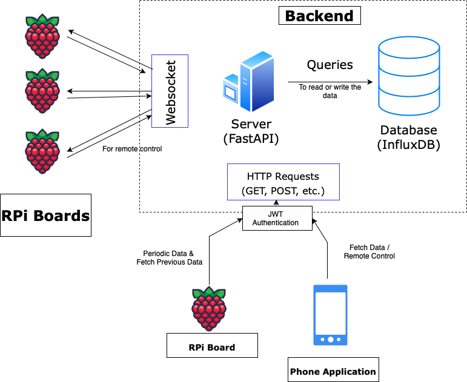

# ⚡ Power Monitoring Backend

This is a FastAPI-based backend system designed for real-time power monitoring and analytics using Raspberry Pi, InfluxDB, and a Flutter mobile client.

---

## 🧱 Project Structure

```
.
├── api/            # Auth, WebSocket, routing, and services
├── analytics/      # Helpers and routes for analytics endpoints
├── databases/      # Scripts for writing/syncing with InfluxDB & SQLite
├── utils/          # Utility modules (DB access, models, relay control)
├── DOC.md          # 📘 Detailed API and system documentation
├── main.py         # Entry point for the FastAPI application
├── config.py       # Settings and environment config using Pydantic
├── EDL.png         # System architecture diagram
├── README.md       # You're here!
```

---

## 🧠 Overview

- 🛰 **RPi devices** collect power metrics every second.
- 🔌 **FastAPI server** ingests, processes, and exposes this data.
- 📈 **InfluxDB** stores time-series sensor data.
- 📱 **Flutter app** fetches data and controls devices remotely.
- 📡 **WebSocket** enables real-time control and feedback.
- 🗂 **SQLite** buffers data locally on RPi when offline.



For detailed architecture and endpoints, refer to [DOC.md](./DOC.md).

---

## 🔐 Environment Setup

Create a `.env` file with the following variables:

```env
INFLUXDB_URL=
INFLUXDB_TOKEN=
INFLUXDB_ORG=
INFLUXDB_BUCKET=
SECRET_KEY=
SIGNUP_SEC_KEY=
```

---

## 🧩 TODO

- [ ] Add Bluetooth pairing between RPi and mobile app to securely exchange `device_code`.
- [ ] Finalize device-user linking policy (single-user or multi-user support per device).

---

## 🚀 Running the Server

```bash
uvicorn main:app --reload
```

Make sure your `.env` is in place and dependencies are installed from:

```bash
pip install -r requirements.txt
```

---

## 📄 License

Licensed under the [MIT License](./LICENSE).

---

## 🤝 Contributions

PRs and issues welcome. Please follow conventional commits and open a discussion before making large changes.

---

> 🔗 Need more? Check the full docs: [DOC.md](./DOC.md)
